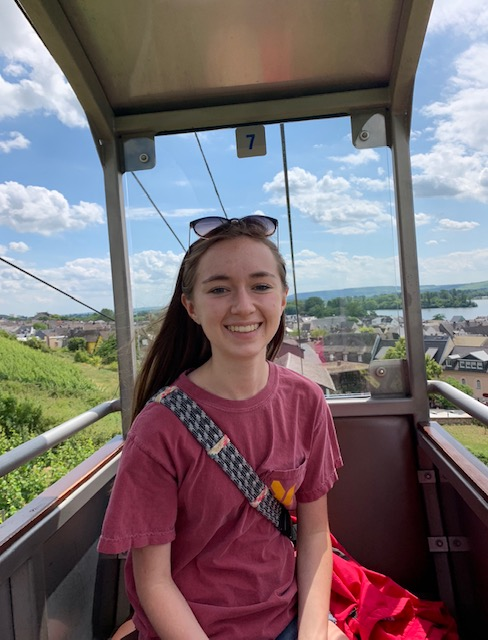

# Kaitlyn Crowley Human Development/Data Science

Hi!  My name is Kaitlyn Crowley.  I am a freshman here at W&M.  Right now, I am hoping to double major in Data Science and Sociology.  In my free time, I love to run, read, and play the violin.  I am excited for this course and to learn more about how data science has implications within human development.

[Assignment 1: Blumenstock 8/25 Response](blumenstock.md)
[Assignment 2: Hans Rosling 8/27 Response]

